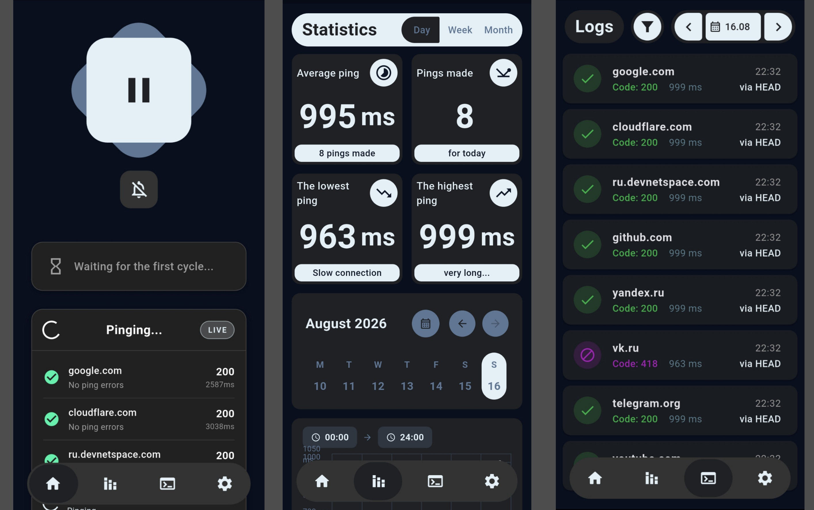

# Abyss Frost
### An app for checking internet access in Russia and elsewhere.

As you probably know, Russia has recently introduced whitelist restrictions for mobile internet access. They keep popping up and down, and it's unclear when the internet will actually be available. That's why I created this app. Its main function is to send a notification when the normal internet is enabled.[^1]

  

The app also has a bunch of other features:
- View ping logs
- View statistics
- Fine-tune ping settings and trigger notifications

I'm too lazy to write more about the bugs:

t.me/ph2n1a
©DevNet -- https://devnetspace.com

[^1]: The internet outage must last more than 5 minutes.
